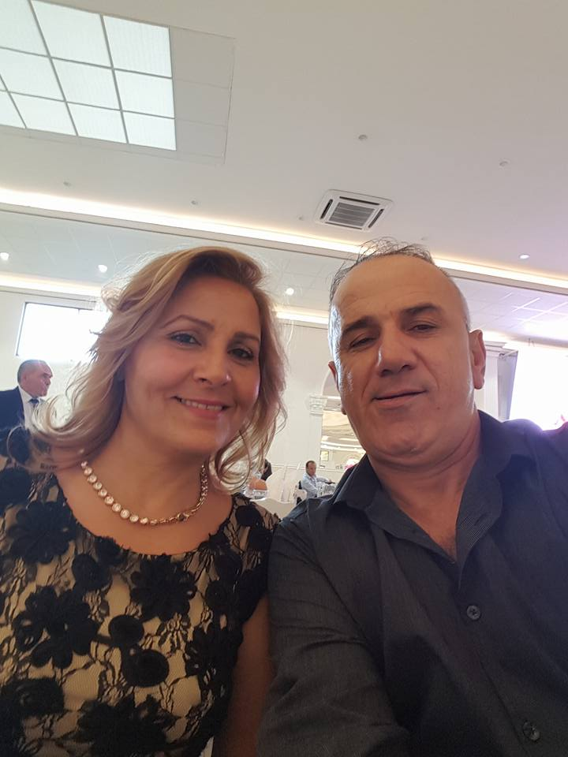
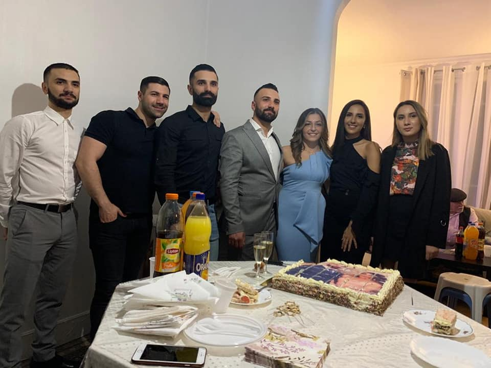
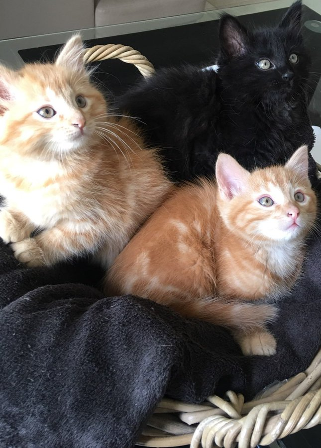
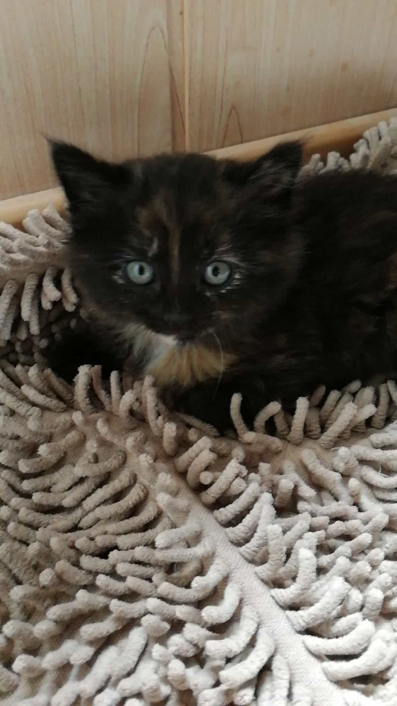
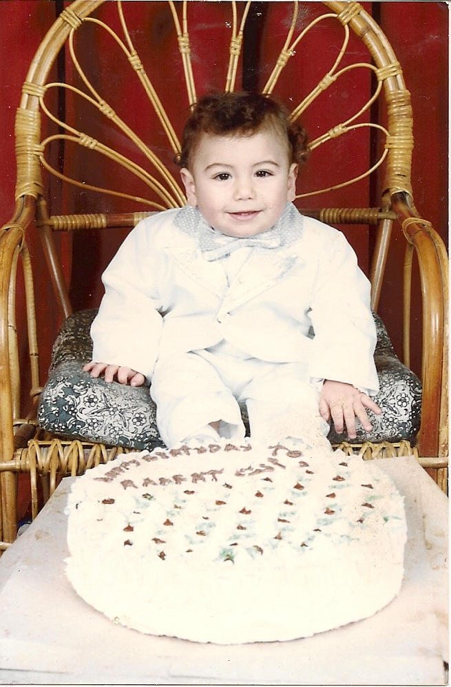
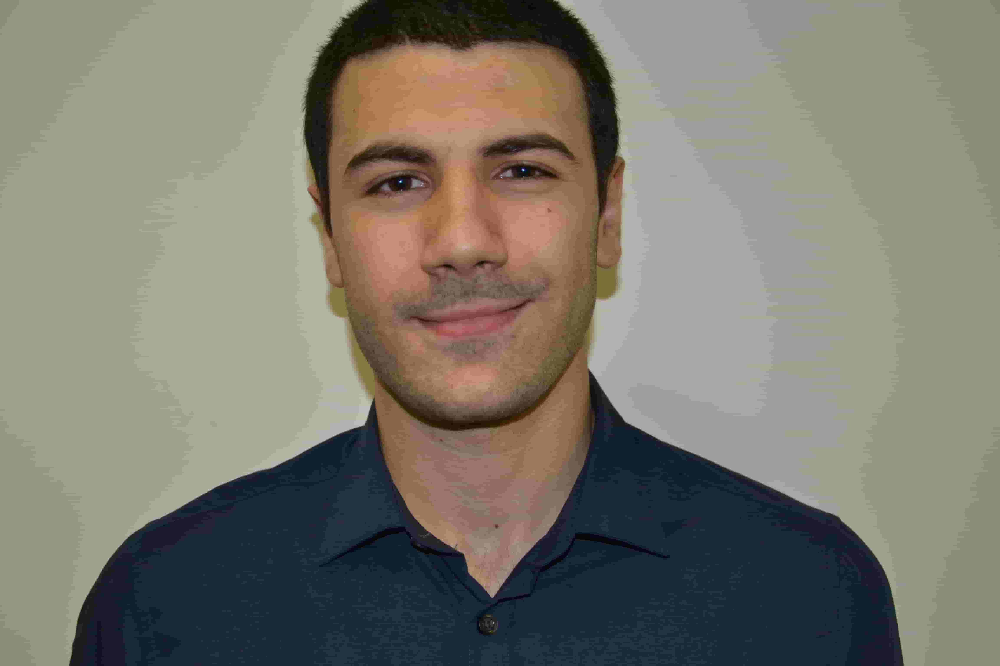
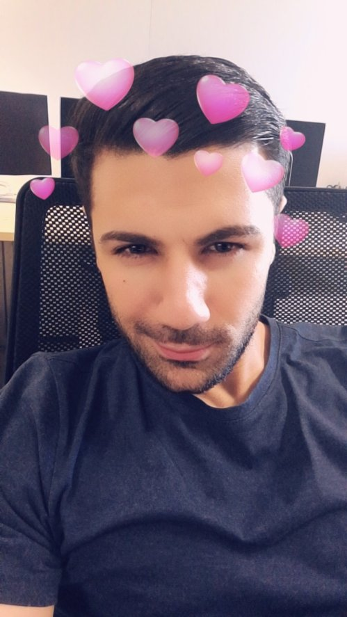

# Dear people of the future

Hello guys!

My name is Robert Georges (born Rafat Petros-Gorguis), I wrote this message as part of the Github Archive Program, 1 hour before the archiving start. I hope everything is good for you and you will be able to read this :-).

I'm a 29 years old Software engineer from Paris. I wrote my first line of code 15 years ago, and never left programming since that day. My favorite language is the D programming language, a powerful general-purpose programming language. You can find it on this platform with the keyword "dlang". I'm actually writing a little game engine with it (evael).

My father left Irak for France in 1991, when the country was at war. I would like to give a big <3 to my family: 

- Baba (Hekmat)
- Mama (Soaad)
- Rami
- Ronak
- David
- Marie
- Mathilda

Here is a picture of my parents: 
 

 
 
Here is a picture of my brothers & sisters:  

 
From left to right: David, me, Rami, Ronak, Natasha (Ronak's gf), Marie and Mathilda.

 
 
My cats (and their mom!): 

 

 
 
Finally, some pictures of me: 

 

 

God bless you, hope you did something good with this earth for all the people around the world <3.

PS: you will find my favorite music in the music directory.